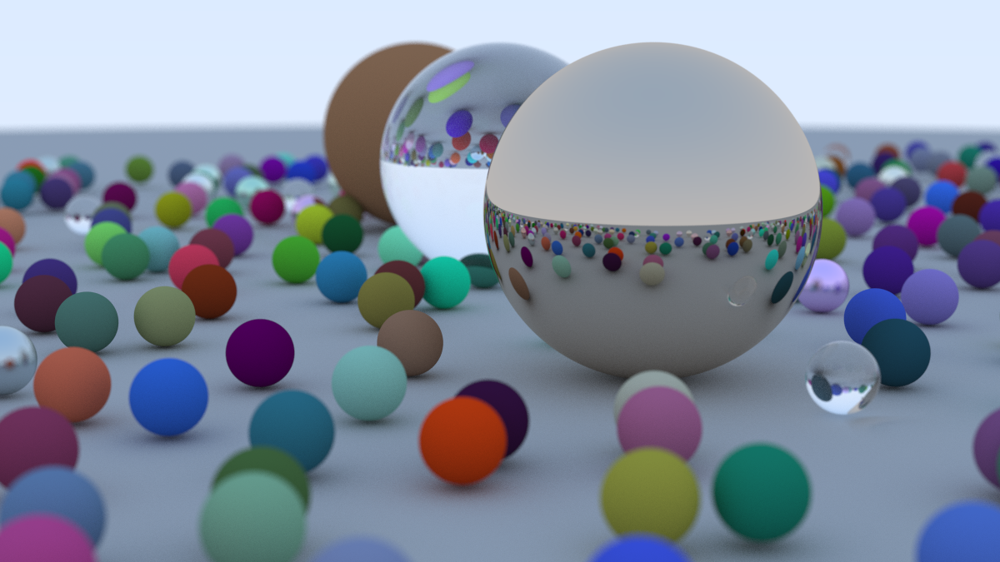

# Rust Ray Tracer

This is a simple ray tracer written in Rust, inspired by the "Ray Tracing in One Weekend" series.



## Building
```
cargo build --release
```

## Running
To generate an image and save it to a file:

```
cargo run --release > image.ppm
```

- The output will be a PPM image file (`image.ppm`) in the project root.


## Project Structure
- `src/main.rs` - Entry point, scene setup, and render loop
- `src/camera.rs` - Camera and ray generation
- `src/hittable.rs` - Hittable trait and hit record
- `src/hittable_list.rs` - List of hittable objects
- `src/sphere.rs` - Sphere implementation
- `src/material.rs` - Material trait and implementations (Lambertian, Metal, Dielectric)
- `src/vec3.rs` - 3D vector math
- `src/color.rs` - Color output and gamma correction
- `src/interval.rs` - Utility for value clamping
- `src/rtweekend.rs` - Math utilities and random number helpers

## Notes
- Materials and objects are shared using `Rc` for efficient memory usage.
- The code is structured to be as close as possible to the C++ "Ray Tracing in One Weekend" book, but idiomatic to Rust.

Adapted from the [_Ray Tracing in One Weekend_](https://raytracing.github.io/books/RayTracingInOneWeekend.html) book.